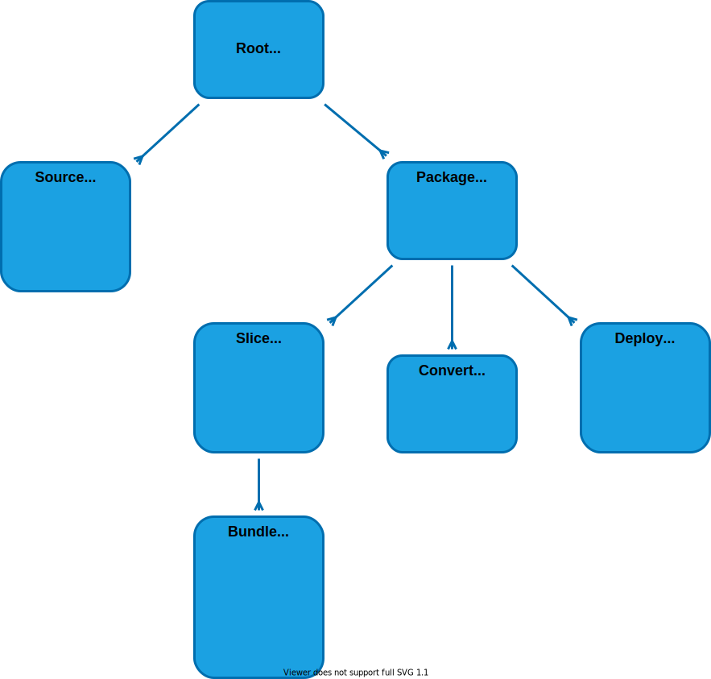

# MAM builder

## Hierarhy



## Test project

```
yarn mam mam/start && node mam/start/-/node.js mam/test/root
```

## Плагины

Типы плагинов: лоадер (`$mam_source_*`), компайлер (`$mam_convert_*`), бандлер (`$mam_bundle_*`).
Реестр — списки `*_classes()` в `$mam_root`. Свой сборщик — наследник с расширенными списками,
подменённый через контекст до старта:

```typescript
namespace $ {

	export class $my_source_gql extends $mam_source {
		static match( file: $mol_file ) { return /\.gql$/.test( file.ext() ) }
		// deps() — зависимости файла с приоритетами (0 — максимум)
	}

	export class $my_convert_gql extends $mam_convert {
		static match( file: $mol_file ) { return /\.gql$/.test( file.ext() ) }
		// generated_sources() — порождённые исходники (попадут к другим лоадерам)
		// generated_artifacts() — готовые файлы для бандлов
	}

	export class $my_root extends $mam_root {
		override source_classes() { return [ ...super.source_classes(), this.$.$my_source_gql ] }
		override convert_classes() { return [ ...super.convert_classes(), this.$.$my_convert_gql ] }
	}

	$.$mam_root = $my_root

}
```

Бандлер запрашивает все исходники нужного типа через лоадер-класс: `slice.files_of( $mam_source_ts )`.

## NPM

```typescript
const doc = $npm[ 'yaml' ].parse( text )
```

Сборщик сам ставит пакет, на вебе собирает его esbuild'ом в самодостаточный чанк
(tree-shaking по реально использованным членам), на ноде отдаёт рантайм-require.
Типы пакетов генерируются в `-web/deps.d.ts` / `-node/deps.d.ts` по факту использования.
